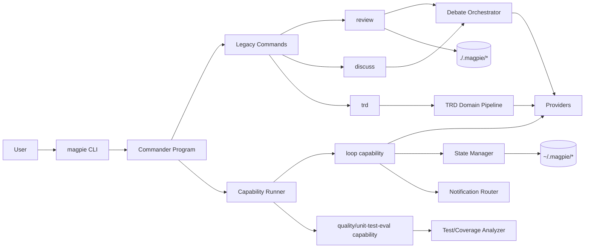
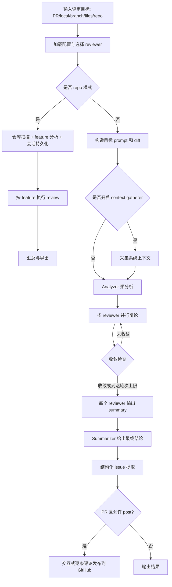
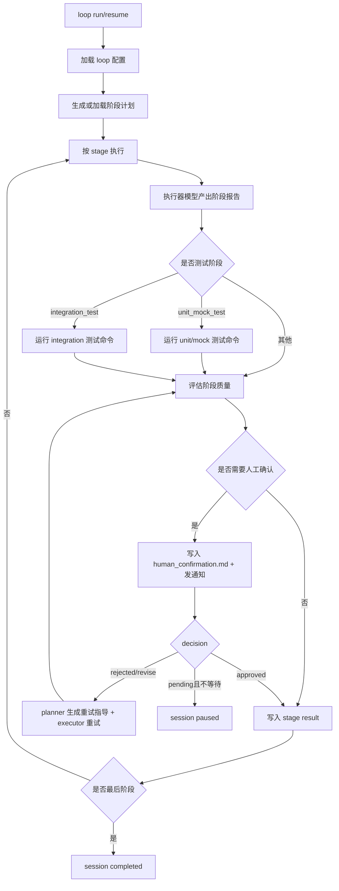

# Magpie

Magpie 是一个多模型协同/对抗的工程化 CLI，当前主要覆盖 5 类能力：

- `review`：多 AI 代码评审（PR、本地 diff、分支 diff、文件级、仓库级）
- `discuss`：多 AI 议题辩论（可加入 Devil's Advocate）
- `trd`：从 PRD Markdown 生成 TRD（含领域划分与开放问题）
- `quality unit-test-eval`：单测质量评估
- `loop`：目标驱动的阶段化执行闭环（含人工确认闸门）

## 当前项目总结（基于代码现状）

这是一个 **V2 capability 架构 + legacy 命令流并存** 的项目。

- 已完整走 capability runner：
  - `loop`
  - `quality/unit-test-eval`
- 仍以 legacy command 为主流程：
  - `review`
  - `discuss`
  - `trd`
- CLI 统一入口：`src/cli.ts` -> `src/cli/program.ts`
- 配置入口：`~/.magpie/config.yaml`
- Provider 同时支持 CLI 型与 API 型模型
- 会话与产物支持持久化，支持中断恢复

## 工作原理图

### 1) 总体架构图（混合架构）



### 2) `review` 辩论流程图



### 3) `loop` 阶段闭环与人工确认闸门



## 目录结构

```text
src/
  cli/                 # CLI 入口与命令注册
  commands/            # legacy 命令实现（review/discuss/trd 等）
  capabilities/        # capability 模块（review/discuss/trd/quality/loop）
  core/                # capability runtime、context、reporting、repo 等基础设施
  platform/            # config v2、provider 适配、通知集成
  providers/           # 模型 provider 实现（CLI + API + mock）
  orchestrator/        # 多 reviewer 辩论编排
  context-gatherer/    # 评审前上下文采集
  state/               # 会话状态持久化
  reporter/            # markdown 报告

tests/                 # Vitest 测试（按模块镜像）
docs/plans/            # 设计与演进文档
dist/                  # tsc 构建产物（不要手改）
```

## 命令现状一览

| 命令 | 作用 | 实现路径 |
|---|---|---|
| `magpie init` | 初始化配置 | legacy command |
| `magpie review` | 代码评审（PR/local/repo） | legacy command + orchestrator |
| `magpie discuss` | 多模型议题辩论 | legacy command + orchestrator |
| `magpie trd` | PRD -> TRD | legacy command |
| `magpie quality unit-test-eval` | 单测质量评估 | capability runner |
| `magpie loop` | 目标闭环执行 | capability runner |
| `magpie stats` | 统计占位命令（简版） | legacy command |

## 安装与构建

```bash
git clone https://github.com/liliu-z/magpie.git
cd magpie
npm install
npm run build
npm link   # 可选，注册全局 magpie
```

## 快速开始

```bash
# 1) 生成配置（交互式）
magpie init
# 或默认配置
magpie init -y

# 2) PR 评审
magpie review 12345
# 或完整 URL
magpie review https://github.com/owner/repo/pull/12345

# 3) 讨论
magpie discuss "Should we use microservices or monolith?"

# 4) PRD -> TRD
magpie trd ./docs/prd.md

# 5) 单测质量评估
magpie quality unit-test-eval . --run-tests

# 6) 目标执行闭环
magpie loop run "Deliver checkout v2" --prd ./docs/prd.md
```

## 常用参数速查

### `review`

```bash
magpie review [pr] [options]

# 常用：
--local
--branch [base]
--files <files...>
--repo
--reviewers <ids>
--all
--skip-context
--no-post
--list-sessions
--session <id>
--export <file>
```

### `discuss`

```bash
magpie discuss [topic] [options]

# 常用：
--reviewers <ids>
--all
--devil-advocate
--list
--resume <id>
```

### `trd`

```bash
magpie trd [prd.md] [options]

# 常用：
--domain-overview-only
--domains-file <path>
--auto-accept-domains
--no-ocr
--list
--resume <id>
```

### `quality`

```bash
magpie quality unit-test-eval [path] [options]

# 常用：
--max-files <number>
--min-coverage <number>
--run-tests
--test-command "npm run test:run"
--format markdown|json
```

### `loop`

```bash
magpie loop run <goal> --prd <path> [options]
magpie loop resume <sessionId> [options]
magpie loop list

# 常用：
--wait-human / --no-wait-human
--dry-run
--max-iterations <number>
```

## 配置说明

默认路径：`~/.magpie/config.yaml`

最小可用示例：

```yaml
providers:
  openai:
    api_key: ${OPENAI_API_KEY}
    # base_url: https://your-compatible-endpoint/v1

defaults:
  max_rounds: 5
  output_format: markdown
  check_convergence: true
  language: zh

reviewers:
  claude:
    model: claude-code
    prompt: |
      You are a senior code reviewer. Focus on correctness, security, architecture, and simplicity.

summarizer:
  model: claude-code
  prompt: |
    Summarize consensus, disagreements and action items.

analyzer:
  model: claude-code
  prompt: |
    Analyze PR context before debate.

contextGatherer:
  enabled: true

trd:
  default_reviewers: [claude]
  max_rounds: 3
  language: zh

capabilities:
  loop:
    enabled: true
    planner_model: claude-code
    executor_model: codex-cli
  quality:
    unitTestEval:
      enabled: true
      min_coverage: 0.7

integrations:
  notifications:
    enabled: false
```

启用 iMessage 通知（BlueBubbles）示例：

```yaml
integrations:
  notifications:
    enabled: true
    default_timeout_ms: 5000
    routes:
      human_confirmation_required: [macos_local, imessage_ops]
      loop_failed: [imessage_ops]
      loop_completed: [imessage_ops]
    providers:
      macos_local:
        type: macos
        click_target: vscode
        terminal_notifier_bin: terminal-notifier
        fallback_osascript: true
      imessage_ops:
        type: imessage
        transport: bluebubbles
        server_url: ${BLUEBUBBLES_SERVER_URL}
        password: ${BLUEBUBBLES_PASSWORD}
        targets:
          - chat_guid:iMessage;-;+8613800138000
        method: private-api
```

说明：

- `imessage` provider 当前首版使用 BlueBubbles REST API。
- `targets` 建议使用 `chat_guid:<guid>`；也兼容直接填原始 BlueBubbles chat guid。
- 直接手机号/邮箱句柄当前不做自动建会话，避免把不稳定逻辑放进通知层。
- 详细接入说明见 `docs/channels/imessage.md`。

## Provider 支持

`model` 字段按下面规则映射：

- CLI 型：`claude-code`、`codex-cli`、`gemini-cli`、`qwen-code`、`kiro`
- API 型：
  - `claude*` -> Anthropic
  - `gpt*` -> OpenAI
  - `gemini*` -> Google
  - `minimax` -> MiniMax
- 调试：`mock`（或 `mock*`）

## 产物与会话存储

- repo review 会话：`<repo>/.magpie/sessions/`
- repo feature 缓存：`<repo>/.magpie/cache/`
- discuss 会话：`~/.magpie/discussions/`
- trd 会话：`~/.magpie/trd-sessions/`
- loop 会话与事件：`~/.magpie/loop-sessions/`
- 人工确认文件（loop）：默认 `<repo>/human_confirmation.md`
- 示例模板：`human_confirmation.example.md`

## 依赖与前置条件

- Node.js 18+
- Git
- 评审 PR 与评论发布建议安装并登录 `gh` CLI
- 若启用 TRD 图片 OCR，需安装 `tesseract`
- 使用 CLI 型 provider 时，需确保对应 CLI 已安装并已登录

## 开发与测试

```bash
# 从源码运行
npm run dev -- review 12345

# 单元测试（watch）
npm test

# 单次测试（CI 推荐）
npm run test:run

# 类型构建
npm run build

# 架构边界检查
npm run check:boundaries
```

## 相关文档

- `docs/plans/2026-03-04-capability-architecture-v2.md`
- `docs/plans/2026-03-05-prd-review-workflow.md`
- `docs/plans/2026-01-26-magpie-design.md`
- `docs/channels/imessage.md`

## 已知现状说明

- `review` / `discuss` / `trd` 在 capability 层目前仍以兼容桥接为主，主执行逻辑在 legacy command。
- `stats` 命令当前为轻量占位实现。
- 项目包含较多 V1/V2 并存模块，重构仍在进行中。

## License

ISC
