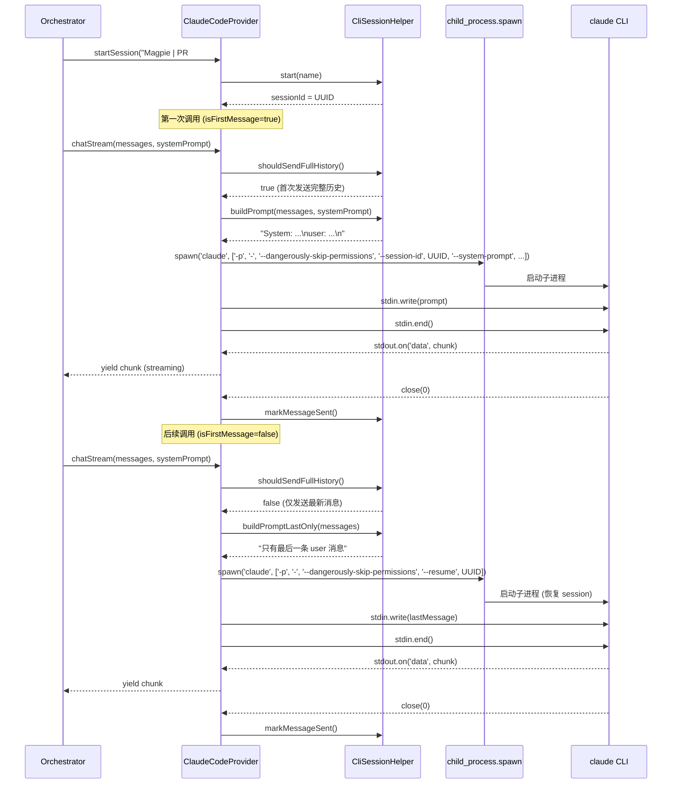
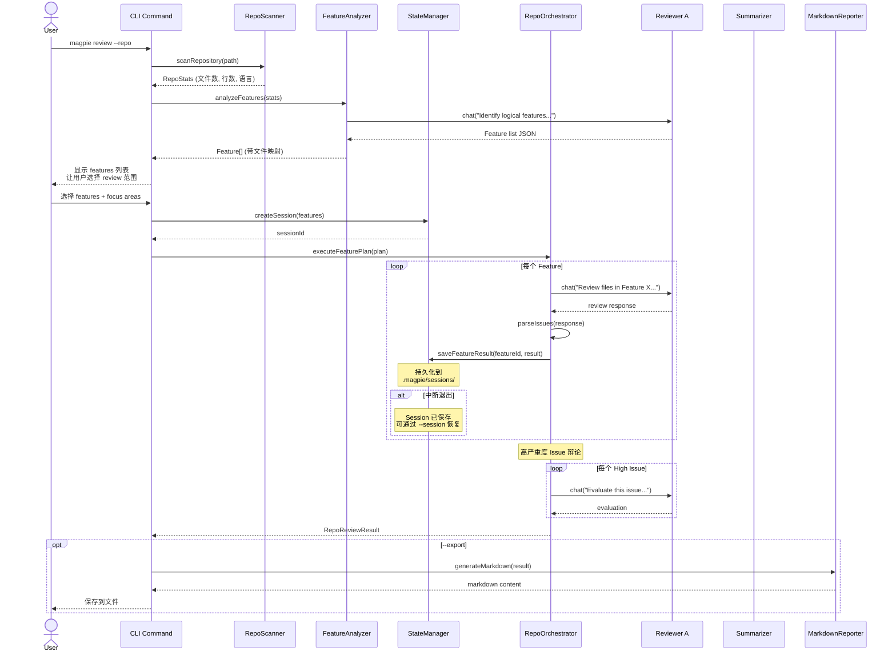
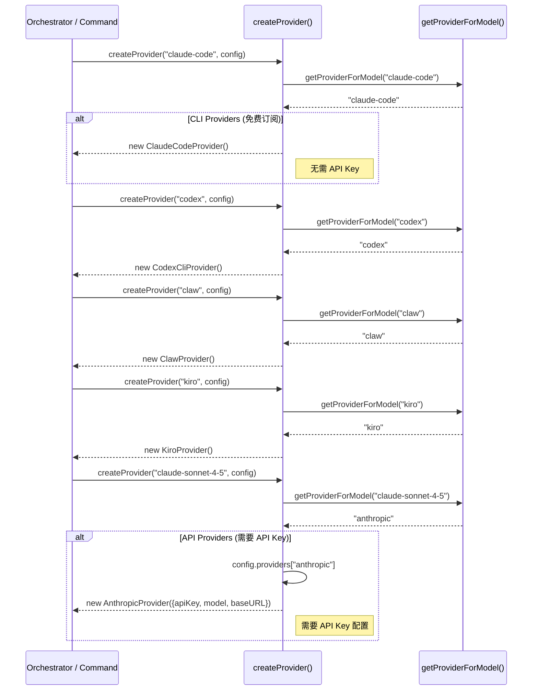

# Magpie 项目实现时序图

## 一、PR Review 完整流程（核心流程）

这是最核心的工作流程，涵盖了从用户输入到最终输出的所有关键步骤。

```mermaid
sequenceDiagram
    actor User
    participant CLI as CLI Command<br/>(review.ts)
    participant Config as Config Loader
    participant Factory as Provider Factory
    participant CG as Context Gatherer
    participant Orch as DebateOrchestrator
    participant Analyzer as Analyzer Provider
    participant R1 as Reviewer A<br/>(e.g. claude-code)
    participant R2 as Reviewer B<br/>(e.g. codex)
    participant Sum as Summarizer Provider

    User->>CLI: magpie review 12345
    CLI->>Config: loadConfig()
    Config-->>CLI: MagpieConfig

    Note over CLI: 获取 PR diff<br/>gh pr diff / git diff

    CLI->>Factory: createProvider(model, config)
    Factory-->>CLI: AIProvider instances

    CLI->>Orch: new DebateOrchestrator(reviewers, summarizer, analyzer)
    CLI->>Orch: runStreaming(label, prompt)

    rect rgb(40, 40, 80)
        Note over Orch,Analyzer: Phase 1: 上下文收集 + 分析 (并行)
        par Context Gathering
            Orch->>CG: gather(diff, label)
            CG-->>Orch: GatheredContext
        and Pre-Analysis
            Orch->>Analyzer: chatStream(prompt, systemPrompt)
            Analyzer-->>Orch: analysis chunks (streaming)
            Orch-->>CLI: onMessage('analyzer', chunk)
            CLI-->>User: 显示分析结果
        end
    end

    rect rgb(40, 80, 40)
        Note over Orch,R2: Phase 2: 多轮辩论
        loop Round 1..N (最多 maxRounds 轮)
            Note over Orch: buildMessages() 为每个 reviewer<br/>构建相同的消息上下文
            par 并行执行所有 Reviewers
                Orch->>R1: chatStream(messages, systemPrompt)
                R1-->>Orch: response chunks
            and
                Orch->>R2: chatStream(messages, systemPrompt)
                R2-->>Orch: response chunks
            end
            Orch-->>CLI: onMessage(reviewerId, chunk)
            CLI-->>User: 实时显示每个 reviewer 的回复

            alt Convergence Check 开启
                Orch->>Sum: chat(convergence prompt)
                Sum-->>Orch: "CONVERGED" / "NOT_CONVERGED"
                Note over Orch: 如果 CONVERGED 提前结束
            end
        end
    end

    rect rgb(80, 40, 40)
        Note over Orch,Sum: Phase 3: 总结
        Orch->>R1: chat("Summarize your review points")
        R1-->>Orch: summary
        Orch->>R2: chat("Summarize your review points")
        R2-->>Orch: summary

        Orch->>Sum: chat(all summaries)
        Sum-->>Orch: Final Conclusion

        Orch->>Sum: chat("Extract structured issues as JSON")
        Sum-->>Orch: MergedIssue[]
    end

    Orch-->>CLI: DebateResult
    CLI-->>User: 显示最终结论 + Issue 表格

    opt Interactive Mode (-i)
        User->>CLI: 讨论/发布评论
        CLI->>R1: chat(follow-up question)
        R1-->>CLI: response
        CLI-->>User: 显示回复
    end

    opt PR Post-Processing
        loop 逐个 Issue
            CLI-->>User: 显示 Issue 详情
            User->>CLI: Post(p) / Edit(e) / Discuss(d) / Skip(s)
            CLI->>CLI: execSync("gh pr comment ...")
        end
    end
```



## 二、CLI Provider 调用时序（Subscription 模式）

展示 CLI provider（如 claude-code）如何通过子进程调用本地 CLI 工具。



## 三、Repo Review 流程

整个仓库级别的 review 流程，包括 feature 检测和 session 持久化。



## 四、Discuss 流程

多 AI 讨论任何技术话题的流程。

```mermaid
sequenceDiagram
    actor User
    participant CLI as discuss.ts
    participant Orch as DebateOrchestrator
    participant R1 as Reviewer A
    participant R2 as Reviewer B
    participant DA as Devil's Advocate
    participant Sum as Summarizer

    User->>CLI: magpie discuss "Should we use microservices?"
    CLI->>Orch: new DebateOrchestrator(reviewers, summarizer, analyzer)

    Note over Orch: 无 Analyzer 阶段<br/>直接进入辩论

    rect rgb(40, 80, 40)
        Note over Orch,DA: 多轮辩论
        loop Round 1..N
            par
                Orch->>R1: chatStream("Share your perspective...")
                R1-->>Orch: opinion chunks
            and
                Orch->>R2: chatStream("Share your perspective...")
                R2-->>Orch: opinion chunks
            and
                opt Devil's Advocate (-d)
                    Orch->>DA: chatStream("Challenge the consensus...")
                    DA-->>Orch: contrarian view
                end
            end

            alt Convergence
                Orch->>Sum: "Have they converged?"
                Sum-->>Orch: verdict
            end
        end
    end

    Orch->>R1: "Summarize your final position"
    R1-->>Orch: summary
    Orch->>R2: "Summarize your final position"
    R2-->>Orch: summary

    Orch->>Sum: chat(all summaries)
    Sum-->>Orch: Final Conclusion

    Orch-->>CLI: DebateResult
    CLI-->>User: 显示结论

    opt Interactive (-i)
        loop Follow-up Q&A
            User->>CLI: 追问
            CLI->>R1: chat(question)
            R1-->>CLI: answer
            CLI-->>User: 显示回答
        end
    end
```



## 五、Provider Factory 创建流程

展示不同 model 如何路由到对应的 provider 实现。



## 六、整体架构层次

```mermaid
graph TB
    subgraph "用户层"
        U[用户终端]
    end

    subgraph "命令层 (src/commands/)"
        RC[review.ts]
        DC[discuss.ts]
        IC[init.ts]
    end

    subgraph "编排层 (src/orchestrator/)"
        DO[DebateOrchestrator<br/>PR/本地/分支 Review]
        RO[RepoOrchestrator<br/>全仓库 Review]
    end

    subgraph "分析层"
        FA[FeatureAnalyzer<br/>AI 功能检测]
        IP[IssueParser<br/>结构化问题提取]
        CG[ContextGatherer<br/>上下文收集]
        PL[ReviewPlanner<br/>Review 计划生成]
    end

    subgraph "Provider 层 (src/providers/)"
        PF[Provider Factory]
        CC[ClaudeCodeProvider]
        CX[CodexCliProvider]
        CLAW[ClawProvider]
        GC[GeminiCliProvider]
        KP[KiroProvider]
        QC[QwenCodeProvider]
        AP[AnthropicProvider]
        OP[OpenAIProvider]
        GP[GeminiProvider]
    end

    subgraph "基础设施层"
        SM[StateManager<br/>Session 持久化]
        HT[HistoryTracker<br/>Review 历史]
        CL[ContextLoader<br/>项目上下文]
        RP[MarkdownReporter]
    end

    subgraph "外部工具"
        CLAUDE[claude CLI]
        CODEX[codex CLI]
        CLAWCLI[claw CLI]
        GEMINI[gemini CLI]
        KIRO[kiro CLI]
        QWEN[qwen CLI]
        API1[Anthropic API]
        API2[OpenAI API]
        API3[Google API]
    end

    U --> RC & DC & IC
    RC --> DO & RO
    DC --> DO
    RO --> FA & PL
    DO --> CG & IP
    DO & RO --> PF
    PF --> CC & CX & CLAW & GC & KP & QC & AP & OP & GP
    CC --> CLAUDE
    CX --> CODEX
    CLAW --> CLAWCLI
    GC --> GEMINI
    KP --> KIRO
    QC --> QWEN
    AP --> API1
    OP --> API2
    GP --> API3
    RO --> SM
    DO --> HT
    DO --> CL
    RO --> RP
